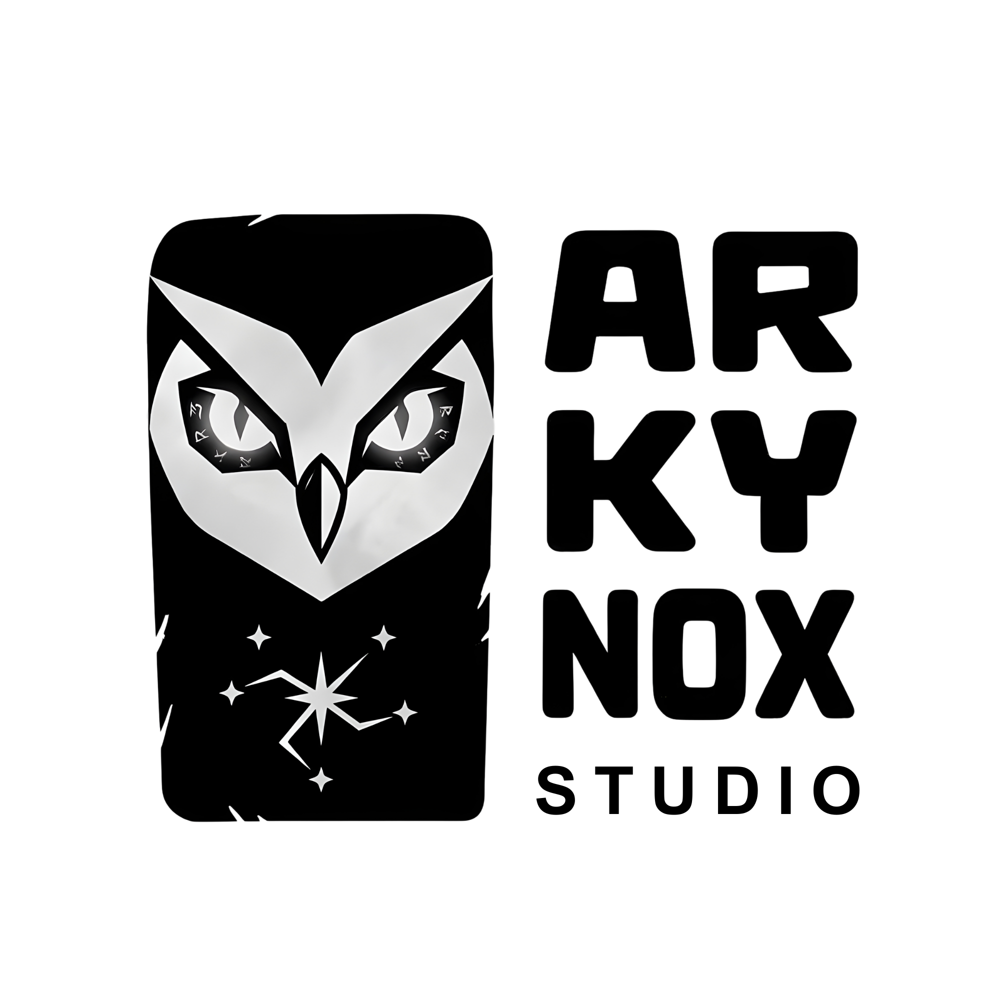

<div align="center">
  <picture>
    <source media="(prefers-color-scheme: dark)" srcset="./public/assets/logo/company-nbg.png">
    
  </picture>
  <br/>
  <h1 align="center">Kaffeine</h1>
  <p align="center">
    Free &amp; Open Source Uptime Monitoring
    <br />
    <a href="https://kaffeine.dev"><strong>kaffeine.dev »</strong></a>
  </p>
  <p align="center">
    <a href="#features">Features</a> •
    <a href="#tech-stack">Tech Stack</a> •
    <a href="#getting-started">Getting Started</a> •
    <a href="CONTRIBUTING.md">Contributing</a> •
    <a href="SECURITY.md">Security</a> •
    <a href="#license">License</a>
  </p>
  <p align="center">
    
    
    
  </p>
</div>

**Kaffeine** is a free, open-source uptime monitoring platform by [Arkynox](https://arkynox.com). Monitor websites and databases with real-time health checks, AES-256 encrypted storage, Cloudflare-powered distributed monitoring, and role-based dashboards — all 100% free.

## Features

- **Website Monitoring** — HTTP/HTTPS health checks with configurable intervals
- **Database Monitoring** — Monitor MongoDB, PostgreSQL, MySQL, and more
- **Real-Time Alerts** — Instant notifications via server-sent events
- **Encrypted Storage** — AES-256 encryption for all connection strings and secrets
- **Distributed Checks** — Cloudflare Workers for global, low-latency monitoring
- **Role-Based Dashboards** — User and admin panels with granular access control
- **Detailed Analytics** — 24-hour uptime charts, status history, and metrics
- **100% Free** — No credit card, no hidden limits, no paid tiers

## Tech Stack

| Layer | Technology |
|---|---|
| Framework | Next.js 16 (App Router, React 19) |
| Language | TypeScript (strict) |
| Styling | Tailwind CSS v4 + shadcn/ui |
| Database | MongoDB |
| Auth | Session-based (HTTP-only cookies) + JWT |
| Real-Time | Server-Sent Events (EventSource) |
| Monitoring | Cloudflare Workers (distributed health checks) |
| Encryption | AES-256-CBC / bcrypt |

## Getting Started

### Prerequisites

- **Node.js** 18+
- **MongoDB** — local or [MongoDB Atlas](https://www.mongodb.com/atlas)
- **Cloudflare account** (optional, for distributed monitoring)

### Quick Start

1. **Clone the repo**
   ```bash
   git clone https://github.com/akkilmg/kaffeine.git
   cd kaffeine
   ```

2. **Install dependencies**
   ```bash
   npm install
   ```

3. **Set up environment variables**
   ```bash
   cp .example.env .env
   ```
   Edit `.env` and fill in your `MONGODB_URI`, `ENCRYPTION_KEY`, and `JWT_SECRET`.

4. **Run the dev server**
   ```bash
   npm run dev
   ```

5. Open [http://localhost:3000](http://localhost:3000) and create your first account.

> See [resource/QUICKSTART.md](resource/QUICKSTART.md) for a detailed walkthrough.

## Contributing

We welcome contributions from everyone! See our [Contributing Guide](CONTRIBUTING.md) for detailed instructions.

Quick links:
- [Code of Conduct](CODE_OF_CONDUCT.md)
- [Bug Reports](.github/ISSUE_TEMPLATE/bug_report.md)
- [Feature Requests](.github/ISSUE_TEMPLATE/feature_request.md)
- [Pull Request Template](.github/PULL_REQUEST_TEMPLATE.md)

### Quick Steps

1. Fork the repo
2. Create a feature branch (`git checkout -b feat/my-feature`)
3. Make your changes
4. Run `npm run lint` and `npm run build`
5. Submit a [pull request](.github/PULL_REQUEST_TEMPLATE.md)

## Security

Found a security vulnerability? Please read our [Security Policy](SECURITY.md) for responsible disclosure guidelines. **Do not** open public issues for security vulnerabilities.

## License

Released under the [Apache License 2.0](LICENSE) by [Arkynox](https://arkynox.com).

---

<div align="center">
  <sub>Built with ❤️ by <a href="https://arkynox.com">Arkynox</a> — <a href="CONTRIBUTING.md">contributions welcome</a>!</sub>
</div>
